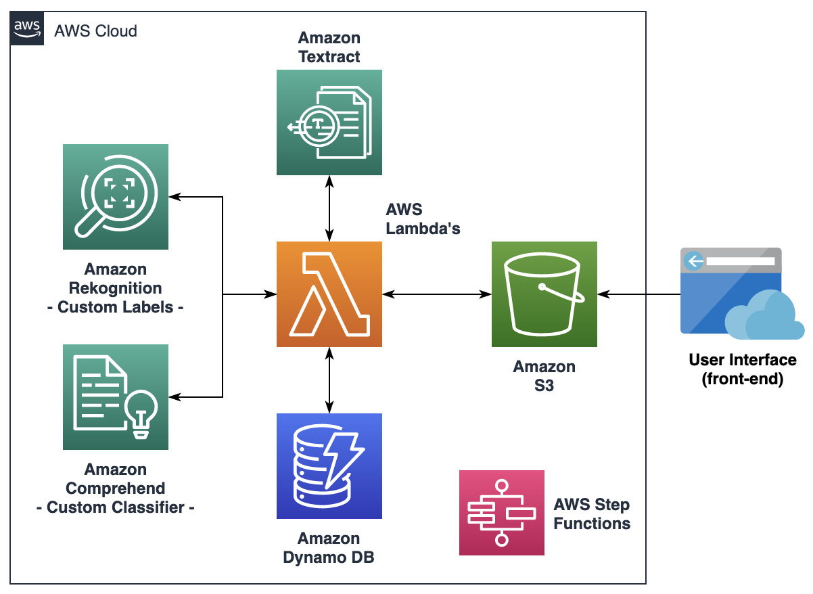
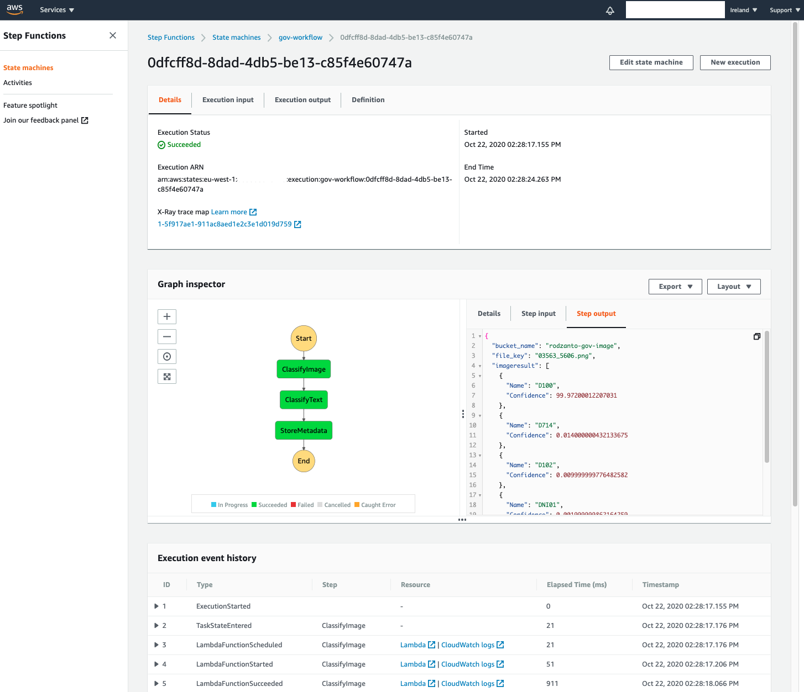
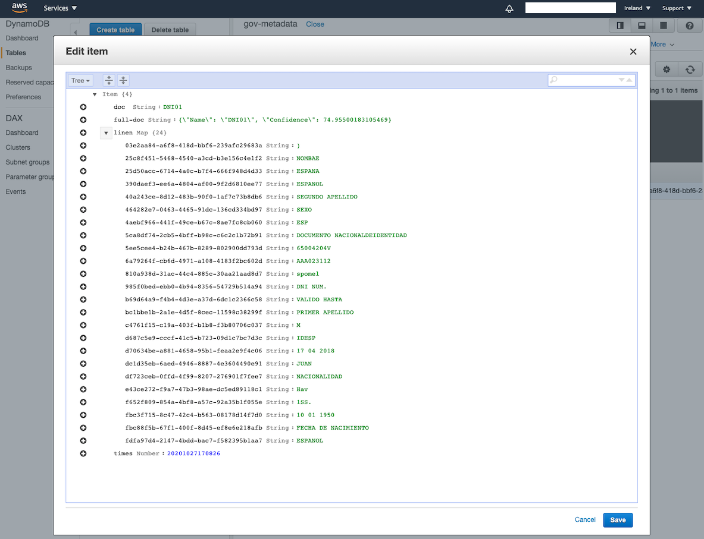

## Personal documentation classifier and metadata extraction with AWS AI services

### Objective:
This demo showcases a state machine with AWS StepFunctions, to be triggered when new documents are stored on a given S3 bucket, for classifying the documents with two methods (Rekognition Custom Labels on image, and Comprehend Custom Classifier on text), and extracting the metadata and text storing it on a DynamoDB table.

### Instructions:

***Note this repo is still not adapted for deploying with AWS CloudFormation - Work in progress**

0. Train an Amazon Rekognition Custom Labels classifier for the images of your documents, and an Amazon Comprehend Custom Classifier for the text of your documents. You have some sample data in the "Data" folder of this repo.

1. Create an Amazon S3 bucket for storing the documents uploaded from your front-end application
2. Create an AWS Lambda function for converting any PDF documents to images, and storing those in another bucket (work in progress)
3. Create an AWS Step Functions state machine following the yaml file provided. Make sure you change the "ACCOUNTID" placeholders according to your account number

4. Go to the properties of the images bucket in S3 and enable an event for triggering the AWS StepFunctions state machine, make sure it triggers for any object creation
5. Create the 3 AWS Lambda functions with the Python scripts provided.
6. For the "gov-classify-image", make sure you create an environment variable called "CUSTOM_LABELS_PROJECT_VERSION_ARN" referencing your Rekognition Custom Labels Endpoint ARN
7. For the "gov-classify-image", make sure you create an environment variable called "CUSTOM_CLASSIFIER_ARN" referencing your Comprehend Custom Classifier Endpoint ARN
8. Create an Amazon DynamoDB table called "gov-metadata", make sure you set an index for Number "times", and sort index for String "doc"

You should now be able to test the solution by uploading a new image to the S3 image bucket, and monitor the execution of the StepFunctions state machine accordingly.

If the process is successful, you should now have a record stored in the DynamoDB table with your document metadata and text.

