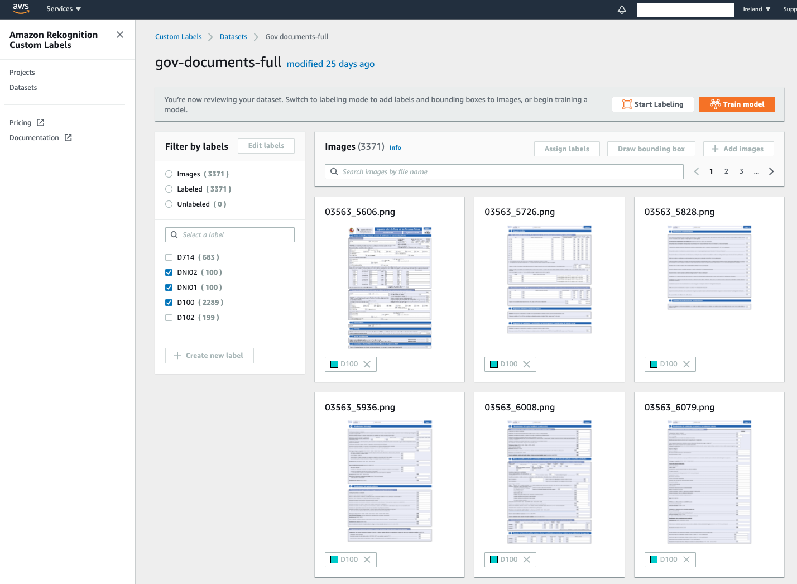

# Personal documentation classifier and metadata extraction with AWS AI services

## Objective:
Remote documents processing is gaining popularity as more and more businesses are transforming and adapting for making the processes more efficient, and also while the physical distancing requirements and remote work have become the new normal.

In this demo, we showcase a personal documentation processing solution powered by AWS AI services. The solution is orchestrated with a state machine in AWS StepFunctions, that is triggered when new documents are stored on a given S3 bucket from e.g. a front-end or web portal. This state machine classifies the documents with two methods: Rekognition Custom Labels on the documents' images, and Comprehend Custom Classifier on the documents' text, while extracting the metadata and storing the text that is relevant for each document type on a DynamoDB table.


## Manual Deployment Instructions:


0. Train an Amazon Rekognition Custom Labels classifier for the images of your documents (you can follow the instructions [here](https://docs.aws.amazon.com/rekognition/latest/customlabels-dg/gs-step-create-dataset.html)), and an Amazon Comprehend Custom Classifier for the text of your documents (you can follow the instructions [here](https://docs.aws.amazon.com/comprehend/latest/dg/how-document-classification-training.html)). You have some sample data for training these custom models in the "Data" folder of this repo.



1. Create an Amazon S3 bucket for storing the documents uploaded from your front-end application
2. Create an AWS Lambda function for converting any PDF documents to images, and storing those in another bucket (work in progress)
3. Create an AWS Step Functions state machine following the yaml file provided. Make sure you change the "ACCOUNTID" placeholders according to your account number


4. Go to the properties of the images bucket in S3 and enable an event for triggering the AWS StepFunctions state machine, make sure it triggers for any object creation
5. Create the 3 AWS Lambda functions with the Python scripts provided.
6. For the "gov-classify-image", make sure you create an environment variable called "CUSTOM_LABELS_PROJECT_VERSION_ARN" referencing your Rekognition Custom Labels Endpoint ARN
7. For the "gov-classify-image", make sure you create an environment variable called "CUSTOM_CLASSIFIER_ARN" referencing your Comprehend Custom Classifier Endpoint ARN
8. Create an Amazon DynamoDB table called "gov-metadata", make sure you set an index for Number "times", and sort index for String "doc"

You should now be able to test the solution by uploading a new image to the S3 image bucket, and monitor the execution of the StepFunctions state machine accordingly.


If the process is successful, you should now have a record stored in the DynamoDB table with your document metadata and text.

## Automated deployment (using SAM)

### Requirements

1. Make sure you have [AWS SAM CLI installed](https://docs.aws.amazon.com/serverless-application-model/latest/developerguide/serverless-sam-cli-install.html)

1. Make sure you have a access to IAM credentials with enough permissions to deploy resources, mainly:
    * IAM roles
    * DynamoDB table
    * EventBridge rule
    * Lambda functions
    * Step Functions
    * S3 bucket

1. Train an Amazon Rekognition Custom Labels classifier for the images of your documents and note down the ARN, [instructions here](https://docs.aws.amazon.com/rekognition/latest/customlabels-dg/gs-step-create-dataset.html.)

1. Start the created Amazon Rekognition Custom Labels classifier 
```
aws rekognition start-project-version \
  --project-version-arn "arn:aws:rekognition:eu-west-1:208442788671:project/gov-classifier/version/gov-classifier.2020-11-18T12.34.06/1605699246166" \
  --min-inference-units 1 \
  --region eu-west-1
```

1. Train Amazon Comprehend Custom Classifier for the text of your documents [you can follow the instructions here](https://docs.aws.amazon.com/comprehend/latest/dg/how-document-classification-training.html).

### Steps to deploy

1. Unzip package on the directory of your choice

1. cd to the main folder (where template.yaml and this README file is located)

1. Build the project with ```sam build``` (you can specify an aws profile using -p flag if needed)

1. Deploy project using  ```sam deploy``` (the first time you will be asked for configuration variables). 

|Variable|Description|
| ------------- |:-------------:|
|CustomLabelsProjectVersionARN|ARN of the previously created Rekognition labeling project, refer to [this doc](https://amzn.to/3oY7Bjr) for more details|
|CustomClassifierARN|ARN of the previously created textract classifier|
|BucketName|Name of the S3 bucket to be created where your application will drop images for processing|


5. (optional) Add record(s) in the gov-config table to customize which lines you want to save on the gov-metadata DDB table for each document type. For getting lines 1, 2 and 3 in DNI01 labelled documents use:

```json
{
  "doc": {
    "S": "DNI01"
  },
  "relevantlines": {
    "S": "[0,1,2]"
  }
}
```


